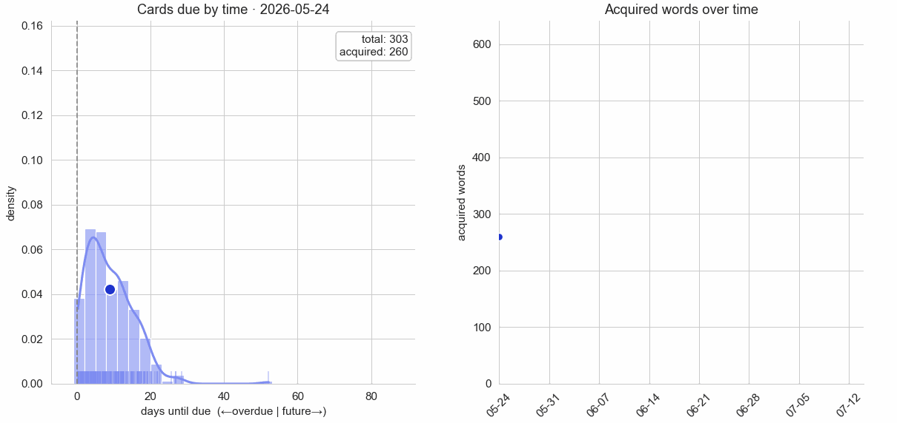
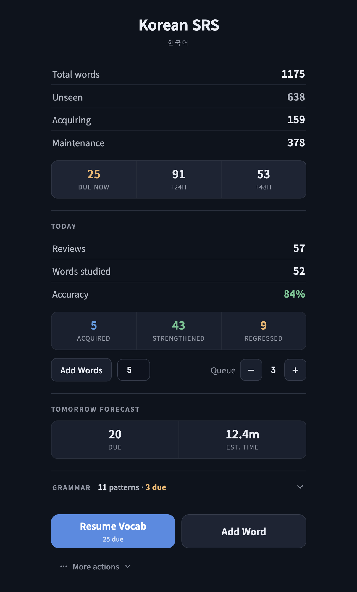
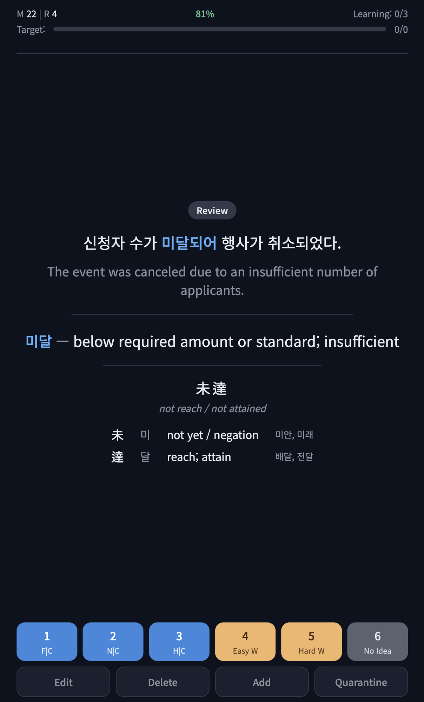
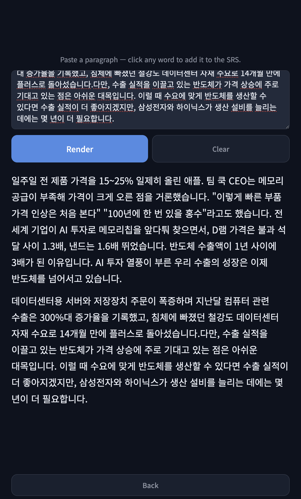
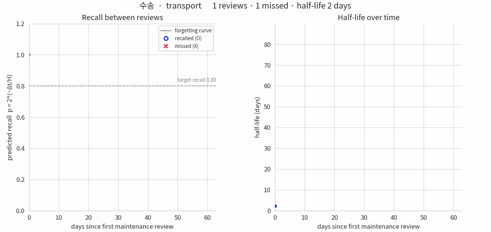

<h1 align="center">Korean SRS</h1>

<p align="center">
A recognition-first spaced-repetition system for Korean. It pairs an adaptive
half-life memory model with LLM-generated example sentences, Hanja breakdowns,
and reading passages.
</p>

<p align="center">
  
</p>

Korean SRS schedules **recognition**: read a Korean sentence with the target
word visible in context, then recall its meaning. A per-word exponential
**half-life** model learns how fast you forget each word and sets the next
review from that estimate, so mature words drift out to long intervals while
shaky ones come back soon. All study material (example sentences, translations,
Hanja, and multi-word reading passages) is generated on demand by an LLM.

## Features

Anki is great, but building cards that put each vocabulary word in a natural
sentence, with a translation and a Hanja breakdown, is slow to do by hand.
Korean SRS generates that context for you and schedules it, with card creation
built specifically for Korean.

<p align="center">
  
  &nbsp;&nbsp;
  
  &nbsp;&nbsp;
  
</p>
<p align="center"><sub>Start screen&nbsp;·&nbsp;Recognition review&nbsp;·&nbsp;Passage mode</sub></p>

- **Recognition review in context.** Every card is a natural example sentence
  with the target word highlighted. Reveal, then grade your recall.
- **Adaptive half-life scheduling.** An exponential forgetting model with a
  per-word, self-calibrating half-life (see [Memory model](#memory-model)). Intervals stretch
  as a word matures and are capped at about 90 days.
- **On-demand Hanja breakdowns.** Tap to see the Sino-Korean characters, their
  readings and meanings, and high-frequency example words. Native words (고유어)
  and loanwords are reported as having no Hanja, and readings are validated
  against Unihan so a wrong character does not slip through.
- **Passage mode.** The LLM weaves several of your due words into one short
  story. Tap words you do not recognize: a tapped target counts as a miss and
  schedules a repair, and tapped non-target words can be added to your deck.
- **Grammar practice.** A separate production-style track for grammar patterns.
  The LLM generates a question for a due pattern, evaluates your typed answer,
  and you self-grade; the same half-life model schedules the next review.
  Patterns and question types are managed on the `/config` page.
- **LLM-generated content.** Define a word, and its example cards, translations,
  and Hanja are produced and validated automatically.
- **Daily new-word budget**, **scaffolded repair on failure**, and a
  **mobile-friendly web UI** (designed to be served to your phone over Tailscale).

## Memory model

Recall probability decays exponentially with a per-word half-life:

```
p(recall) = 2^(-Δt / H)
```

where `H` is the half-life (seconds) and `Δt` the time since last review.

<p align="center">
  
</p>
<p align="center"><sub>
One word's recognition history (수송, "transport"). Left: recall decays between
reviews and resets at each one (blue O recalled, red X missed); the scheduler
aims to review as predicted recall reaches the 0.80 target. Right: the half-life
grows as the word is recalled, stretching the interval from about a day to about
78 days.
</sub></p>

### Grading

Six grades capture self-reported recall quality. Grades 1-3 are correct, 4-6
are wrong. Each grade carries a **fluency weight** `w` that scales how strongly
the review moves the half-life. The weight sets magnitude only; correct always
grows `H` and wrong always shrinks it.

| Grade | Label   | Weight `w` | Meaning                      |
|:-----:|---------|:----------:|------------------------------|
|   1   | F\|C    |    3.0     | Fluent, effortless recall    |
|   2   | N\|C    |    2.0     | Correct but had to think     |
|   3   | H\|C    |    1.5     | Correct but hard to retrieve |
|   4   | Easy\|W |    0.05    | Wrong but close              |
|   5   | Hard\|W |    0.10    | Wrong, far off               |
|   6   | No Idea |    1.0     | Complete blank               |

### Half-life update rule

A Bernoulli-NLL gradient update with an H-dependent learning rate and the
per-grade fluency weights.

**H-dependent learning rate:**
```
η_eff(H) = ETA_BASE + ETA_BOOST / (1 + H / H_SCALE)
```

**Correct (grades 1-3):**
```
δlogH = +η_eff(H) · w[grade]                              (positive → H grows)
```

**Wrong (grades 4-6):**
```
δlogH = -η_eff(H) · w[grade] · min(p̂/(1-p̂), MAX_ODDS)    (negative → H shrinks)
```

**Clamp:**
```
H_new = clamp(H · exp(δlogH), MIN_HALF_LIFE, MAX_SCHED_HALF_LIFE)
```

Key properties:

- Correct always grows `H` and wrong always shrinks it, so there is no
  "correct but shrinking" case.
- The odds ratio `p̂/(1-p̂)` acts as a confidence weight on wrong reviews. Being
  wrong when confident (`p̂≈0.95`, odds≈19) is penalized heavily; being wrong on
  a word you had already forgotten (`p̂≈0.01`) barely moves `H`.
- Growth on a correct review depends only on the current `H`. It does not depend
  on when you happened to review.

### Scheduling

The next interval comes from a target recall probability:

```
Δt = -H · log₂(p*)          p* = 0.80  (recognition target recall)
```

Half-lives are clamped so the scheduled interval never exceeds about **90 days**
(`MAX_SCHED_HALF_LIFE`). A separate `MAX_HALF_LIFE` (the `H` giving a 1-year
interval) marks full retirement ("learned"). With the 90-day scheduling cap in
place, words settle into a quarterly cadence instead of retiring.

### Calibration

`calibrate_model.py` fits parameters by replaying the review history and
minimizing the mean negative log-likelihood over the **recognition maintenance**
reviews (Day 0, repair, and legacy/production reviews are excluded):

```
minimize  (1/N) Σᵢ  -[ yᵢ·ln(p̂ᵢ) + (1-yᵢ)·ln(1-p̂ᵢ) ]
```

Free parameters (scipy L-BFGS-B): `eta_base`, `eta_boost`, `h_scale`,
`w_1..w_6`, the graduation/seed half-life, and `max_odds`. Run with
`--recognition-only` to fit the current scheduled skill.

The fit is self-correcting. If η is too large, `H` grows too fast and the model
predicts `p ≈ 1`, so any wrong answer produces a large NLL penalty through the
odds ratio and the optimizer is pushed back.

### Learning flow

Every word moves through a small set of phases. Only **recognition** is
scheduled; production cards stay in the database but are never reviewed.

```
NEW → Day 0 (2 recognition intros) → Maintenance (half-life SRS)
                                          │
                                          ▼  (on a wrong answer)
                                        Repair → (return to maintenance)
```

- **Day 0.** A new word is shown as a couple of recognition intro cards
  (`intro_examples`, default 2), each a different example sentence, with no
  grading. It then enters maintenance directly with a graduation half-life of
  about 3.1 days (first review about 1 day out).
- **Maintenance.** Recognition reviews scheduled by the half-life model above.
- **Repair.** A wrong answer shrinks the half-life and queues a single graded
  recognition re-test. The re-test is deferred behind normal reviews, so a
  just-missed word is not shown again immediately.

New words are introduced up to a **per-day budget** (`target_new`), so restarts
and fresh sessions do not pile on additional new cards.

## Quickstart

You need Python 3.10 or newer, git, and an OpenAI API key.

```bash
git clone https://github.com/CorbinFoucart/kor-srs.git && cd kor-srs
python -m venv .venv && source .venv/bin/activate
pip install -r requirements.txt

cp .env.example .env      # then edit .env and add your OpenAI API key
source .env

# seed a deck. Generates example cards with the LLM (a handful of API calls,
# about a minute). With no --words it uses a small built-in starter list; pass
# --words to choose your own.
python seed_static_cards.py --db mydeck.sqlite
# python seed_static_cards.py --db mydeck.sqlite --words 먹다 자다 가다

# start the web server, then open http://localhost:8000
python web_server.py --db mydeck.sqlite --target-new 5 --queue-size 3 --intro-examples 2
```

What to expect on the first session: each new word is shown as a couple of intro
cards, then its first real review is scheduled about a day out. So once the
intros are done the queue goes quiet until reviews come due. `--target-new` sets
how many new words are introduced per day, and `--intro-examples` how many intro
cards each gets. Seeding and Hanja lookups call the OpenAI API; reviewing an
existing deck does not.

## Running

More commands (point `--db` at your own deck):

```bash
# terminal review session instead of the web UI
python review_cli.py --db mydeck.sqlite --target-new 5 --queue-size 3 --intro-examples 2

# calibrate the model against your review history (recognition only)
python calibrate_model.py --db mydeck.sqlite --recognition-only --save

# analysis and diagnostics
python daily_analysis.py --db mydeck.sqlite
python print_db.py --db mydeck.sqlite
python print_reviews.py --db mydeck.sqlite
```

## Controls

**Web UI.** Tap the card to reveal, then grade with the 1-6 buttons
(1 = F\|C through 6 = No Idea). Edit / Delete / Add / Quarantine manage variants,
and **한자 보기 · Hanja** shows the breakdown. The `/config` page manages grammar
patterns and question types.

**CLI.** `space` reveal / next · `1`-`6` grade · `e` edit · `d` delete variant ·
`a` add variant · `r` reading question (waiting screen) · `q` quit.

## Architecture

Three layers with strict separation. The CLI/web layer never touches the SRS
internals or the database directly:

```
review_cli.py / web_server.py   (UI: terminal + FastAPI web app)
        │   via SRSProvider / ReviewItem protocols
        ▼
lexeme_srs.py                   (SRS layer: phase dispatch + queues + scheduling)
        │   SQLAlchemy ORM
        ▼
srs_db.py                       (DB: schema, queries)
```

Pure model logic lives in `acquisition_model.py` (phases + repair) and
`incremental_model.py` (the half-life memory model). `hanja.py` and
`hanja_validate.py` handle Hanja lookup with Unihan-gated reading validation.
`passage_review.py` generates and grades reading passages.

### Key constants

`incremental_model.py` (recognition-calibrated):

| Constant | Value | Purpose |
|----------|-------|---------|
| `GRADE_WEIGHT` | `{1:3.0, 2:2.0, 3:1.5, 4:0.05, 5:0.10, 6:1.0}` | Per-grade fluency weights |
| `ETA_BASE` / `ETA_BOOST` | 0.50 / 5.0 | Learning-rate asymptote / small-H boost |
| `H_SCALE` | 3,000 s | η transition scale |
| `MAX_SCHED_HALF_LIFE` | ~90-day interval | Scheduling clamp on `H` |
| `MAX_HALF_LIFE` | ~1-year interval | Retirement ("learned") threshold |
| `MAX_ODDS` | 5.0 | Odds-ratio clamp on wrong reviews |
| `MIN_HALF_LIFE` | 5 s | `H` floor |
| `TARGET_RECALL` | recognition: 0.80 | Scheduling target |

`acquisition_model.py`: `GRADUATION_H` = 270,000 s (~3.1d, the maintenance seed),
`REPAIR_RETRY_DELAY` = 90 s.
